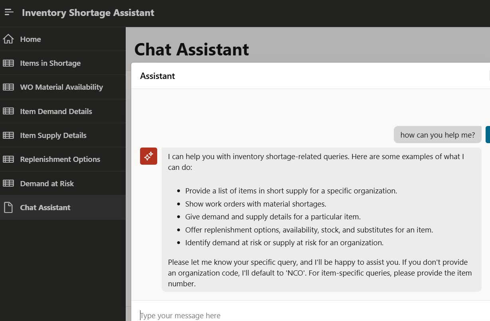
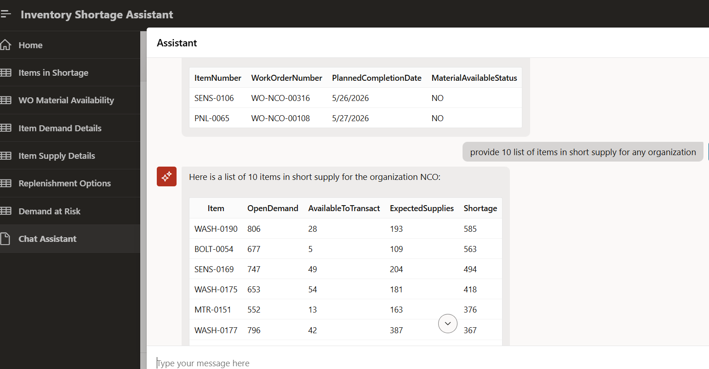

# Oracle APEX 26.1 AI Agent – Inventory Shortage Assistant

## 🚀 Overview

This project demonstrates an AI-powered Inventory Shortage Assistant built using **Oracle APEX 26.1 AI Agent capabilities**.

The solution replicates and reimagines capabilities similar to Oracle AI Agent Studio by enabling **natural language interaction with inventory data**, using a controlled and tool-driven approach.


## 🧠 Problem Statement

In enterprise supply chain systems, identifying:

- Inventory shortages  
- Demand vs Supply gaps  
- Work order risks  

requires navigating across multiple reports and dashboards.

This project explores:

👉 Can AI reduce this complexity into a simple conversation?


## 💡 Solution Approach

An AI-driven assistant is designed using:

- Oracle APEX AI Agent  
- SQL-based retrieval tools  
- Generative AI integration (Cohere API)

Users can ask queries like:

- “Which items are in shortage?”  
- “Show demand details for item X”  
- “Work orders with material shortage”  


## ⚙️ Architecture & Design

This implementation follows a **controlled RAG-like (Retrieval Augmented Generation) approach**:

1. AI detects user intent  
2. Calls appropriate SQL-based tool  
3. Retrieves structured enterprise data  
4. Generates response only from retrieved data  

✅ Prevents hallucination  
✅ Ensures enterprise-grade accuracy  


## 🔧 Key Features Implemented

- AI Chat Assistant in APEX  
- Intent-based tool routing  
- Mandatory parameter enforcement  
- Real-time SQL data retrieval  
- Inventory shortage analysis  
- Demand & supply insights  
- Work order material availability  
- Multi-organization stock insights  


## 📊 Enterprise Data Model

Simulated enterprise schema used:

- `INV_ITEMS`  
- `INV_DEMAND`  
- `INV_SUPPLY`  
- `MFG_WORK_ORDERS`  
- `INV_ORGS`  


## 🖼️ Screenshots

### AI Chat Assistant


### Inventory Shortage Insight



## 📁 Application Export

The complete Oracle APEX application export is available:

```
f204925.sql
```


## 🎯 What I Learned

- Oracle APEX 26.1 AI Agent capabilities  
- Integration with Generative AI APIs  
- Designing tool-based AI architecture  
- Implementing RAG-style systems using SQL  
- Building enterprise-ready AI assistants  


## 🧠 Key Insight

While Oracle AI Agent Studio provides standardized AI capabilities for enterprise applications,

👉 **Oracle APEX enables developers to build fully customizable AI agents using any data source**

This provides:

- Greater flexibility  
- Full control over logic  
- Faster innovation  


## ⚠️ Note
This project uses **anonymized and simulated data** and does not include any client-specific information.


## 📹 Demo (To be added)
A walkthrough video demonstrating real-time usage will be added.

## 👤 Author
Built by Tushar Dhanuka